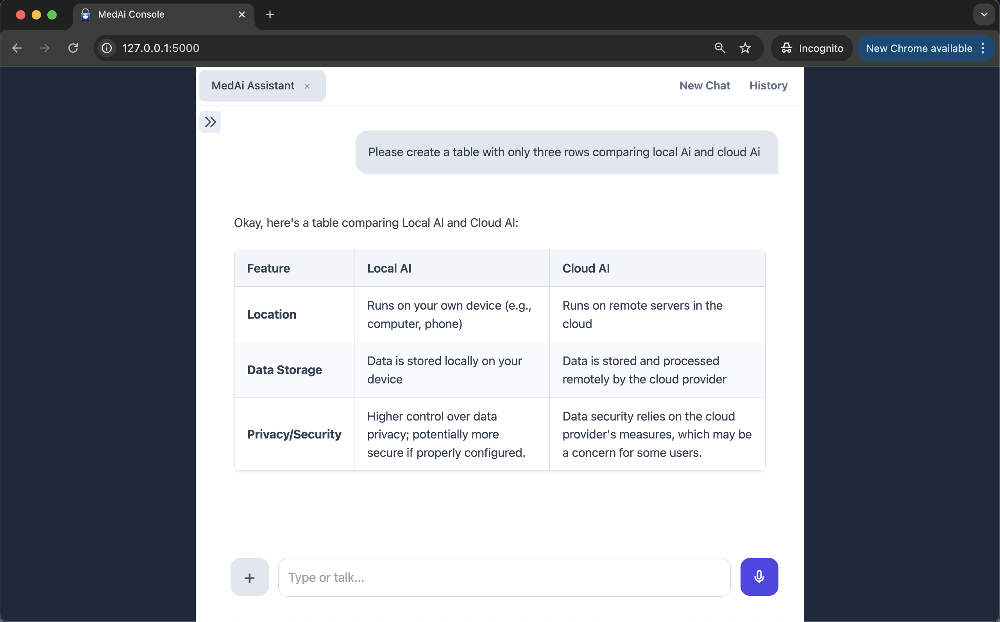

# Offline MedAi Console
<strong>A multimodal Ai collaborator for clinicians. Powered by MedGemma.</strong>
> 
> Prototype - For demonstration, education and inspiration


<br>

The MedAi Console is a transparent, offline-first and privacy-first multimodal Ai console where clinicians can talk, type, show images, adjust parameters and create Ai tools. Uses Flask for the backend, Whisper for Speech-to-Text (STT), Kokoro for Text-to-Speech (TTS), and Ollama to serve the Large Language Model (LLM).

The console is powered by Google's MedGemma 4B model - a multi-skilled medical model. It’s trained to interpret medical images in four specialities: 
- Radiology (X-rays, CT scans)
-  Digital Pathology (Tissue slides)
-   Dermatology (Skin conditions)
- Ophthalmology (Retinal scans).

The model can also understand medical documents. Moreover, it has the general purpose capabilities of the original Gemma3 model from which it was derived. For example, MedGemma is multilingual.


<br>


<p>Minimalist UI</p>

<br>


<br>

## Key Features

<br>

- <strong>100% Offline and Private:</strong> Can run anywhere care is delivered. Your conversations and data never leave your local machine.
- <strong>Fully Transparent:</strong> All code files are accessible for review. No black-box executables or proprietary wrappers.
- <strong>Multimodal:</strong> Chat using text and images (supports JPG, PNG, WebP, and multi-page PDFs).
- <strong>Voice Chat:</strong> Have a conversation with your Ai.
  
- <strong>Create Ai Tools:</strong> Create specialized assistants with unique personas, tailored for specific tasks (e.g. x-ray analysis, text summarization, text extraction).
- <strong>Advanced Model Controls:</strong> Tune the performance of models with adjustable parameters like temperature, context size, and top_p.
- <strong>Webcam Photos:</strong> Use the webcam to send photos of hand drawn diagrams and prescriptions directly to the chat.

- <strong>Chat History:</strong> All conversations are saved in a portable file that can be moved to a secure location or deleted.
- <strong>Supports math notation and code rendering:</strong> Ideal for use as an Ai tutor.
- <strong>Single-file architecture:</strong> Code is easy to audit because HTML, CSS, JS and Python are all in one file. HIPAA compliance thinking is built into the design.

<br>

## Key Innovations

<br>

The innovation is not in creating new technologies but in combining and optimizing existing technologies:

- <strong>Self-Contained Single-File Architecture:</strong> The entire application logic is contained in a single file. This design offers two major benefits: it provides a low barrier for tinkering and Ai modification, and more importantly, it makes the codebase easy to audit for security and privacy.

- <strong>"Double-Click to Run" Accessibility:</strong> Through a simple .command MacOS script, the application can be launched without needing to use the command line, making it accessible to non-programmers.

- <strong>High-Performance Hybrid Network:</strong> The app intelligently uses both HTTP and WebSockets. HTTP provides robust handling for file uploads, while WebSockets enable a real-time, low-latency connection for streaming AI responses and audio.

- <strong>Fast Audio with Sentence-by-Sentence TTS:</strong> Instead of waiting for the AI to generate its full response, text-to-speech audio begins playing sentence by sentence, creating a much more fluid and natural conversational experience.


<br>


<p>Supports images</p>

<br>


<p>Supports pdf files</p>

<br>


<p>Supports math notation and code rendering</p>

<br>


<p>Settings panel hidden</p>

<br>

## Why does this console only support MacOS?

- Base spec silicon Macs (256 GB storage, 16 GB RAM, built in GPU) are able to run the MedGemma model at a token speed that's fast enough to be useful.
- Macs are reliable and privacy focused.
- Silicon Macs have battery life that's greater than 12 hours. This is important for a good user exerience, because local inference uses alot of battery power.
- The relative low cost of a base spec Silicon Mac (669 USD for Mac Mini, 999 USD for Macbook Air) makes local Ai accessible to ordinary people.

<br>


## How to Install and Run

<br>

In this section you will do the following:
- Install the Ollama desktop app
- Download an Ollama model
- Install the UV Python package manager
- Install ffmeg
- Start the app by double clicking a file

<br>

```
--------------------------------------------------------------
System Requirements
--------------------------------------------------------------

Operating System: macOS
Computer: Apple Silicon Mac (M1, M2, M3, M4)
RAM: 16GB
Free disk Space: 10 GB

--------------------------------------------------------------
Step-by-Step Setup
--------------------------------------------------------------

If you already have Ollama, UV and ffmeg installed then please skip those steps.


1. Download and install the Ollama desktop application
--------------------------------------------------------------

This is the link to download Ollama. After downloading, please install it on your computer.
Then launch it. A white chat window will open.
https://ollama.com/

Ollama launches automatically when you start your computer.


2. Download the MedGemma-1 GGUF model from Huggingface (7.77 GB)
----------------------------------------------------------------

1. Open the terminal on your Mac
2. Paste in this line and press Enter:
ollama run hf.co/unsloth/medgemma-4b-it-GGUF:BF16


Optional:
If you also want to download MedGemma-1.5 GGUF (7.77 GB), use this command:
ollama run hf.co/unsloth/medgemma-1.5-4b-it-GGUF:BF16

3. Install ffmpeg
--------------------------------------------------------------

# Use Homebrew (https://brew.sh/)

1. Open the terminal on your Mac
2. Paste in this line and press Enter:
brew install ffmpeg


4. Install UV
--------------------------------------------------------------

Paste this command into the terminal and press Enter:
wget -qO- https://astral.sh/uv/install.sh | sh


5. Download the project folder and place it on your desktop
--------------------------------------------------------------

1. On GitHub click on "<> Code". The select "Download Zip"
2. Download the project folder and unzip it.
3. Inside you will find a folder named: MedAi-Console-v1.0
4. Place MedAi-Console-v1.0 on your desktop.


5. Install the App
--------------------------------------------------------------

1. cd into MedAi-Console-v1.0 folder:
cd Desktop
cd MedAi-Console-v1.0

7. Paste this command into the terminal and press Enter
cat start-mac-app.command > temp && mv temp start-mac-app.command && chmod +x start-mac-app.command

8. Open the MedAi-Console-v1.0 folder
9. Double click this file: start-mac-app.command
10. The app will auto download all requirements and then open in your browser.


--------------------------------------------------------------
Using the App
--------------------------------------------------------------

The name of the model you downloaded will appear in the dropdown menu in the top left.
You can submit images and pdf documents in addition to text.

You can also talk to the Ai model by clicking on the Mic icon.
The Ai voice is turned off by default. You can turn it on in Voice Settings.
Any changes you make to the settings will be automatically saved.

The app does not stop running when you close the browser tab.
To shut down the app, close the terminal window.
You can also close the terminal by selecting it and typing Ctrl+C on Mac.


--------------------------------------------------------------
Future startup
--------------------------------------------------------------

Now that the setup is complete, in future simply double-click the start-mac-app.command file
to launch the app.
The project folder must be placed on your desktop before the app is launched.

You could start the app and leave it running in the background all day.
Then whenever you want to use it, enter the following url in your browser:

http://127.0.0.1:5000/

Your browser will remember this local address so you won't have to.


--------------------------------------------------------------
Troubleshooting
--------------------------------------------------------------

1. If the app doesn't start, make sure Ollama is running (look for its icon in your menu bar)
2. If you see "connection refused", restart Ollama
3. Inference time will increase as you increase the context size setting.
4. Expect inference time to be longer when submitting large images or pdf files.
5. For the voice (TTS) to work Kokoro needs two files: kokoro-v1.0.onnx, and voices-v1.0.bin.
These files are auto downloaded during the setup process.
However, if the voice is not working then please download these files manually and
place them in the project folder:

kokoro-v1.0.onnx: https://github.com/thewh1teagle/kokoro-onnx/releases/download/model-files-v1.0/kokoro-v1.0.onnx

voices-v1.0.bin: https://github.com/thewh1teagle/kokoro-onnx/releases/download/model-files-v1.0/voices-v1.0.bin


```


<br>

## Technologies Used

<strong>Backend:</strong> Flask (HTTP), Flask-SocketIO (WebSockets), Ollama Python<br>
<strong>Frontend:</strong> HTML, Tailwind CSS, JavaScript<br>
<strong>File Processing:</strong> PyMuPDF (for PDFs)<br>
<strong>Speech-to-Text:</strong> OpenAI Whisper<br>
<strong>Text-to-Speech:</strong> Kokoro TTS


<br>

## Notes

- Because MedGemma-1.5 is a reasoning model, I've set up the app to disable voice output when the MedGemma-1.5 model is selected.
- For best results when using your voice - use a headset or earphones with a mic. This reduces background noise. It also allows for a more relaxed chat because you won't have to constantly focus on being clearly heard by the speech to text system.

- When setting up a tool (specialized assistant) that uses voice, it helps to tell it (in the system message) not to use markdown - or else the Ai will speak the markdown symbols out loud.
- When creating agents/tools that will generate math notation, you need to tell the agent to use LaTeX when generating math notation. Please add this note to the system message: Use LaTeX notation for mathematical or scientific expressions.

- Whisper is an LLM, and it can hallucinate. It sometimes generates random text like "Thank you for watching!". This text then gets converted in to speech.
- At first glance the single-file architecture may look like a naive simplification created for non-technical users and for easy auditing - but it's much more. It's an architecture pattern that's optimized for AI-assisted development - a "see the entire picture at once" pattern that supports fast and efficient Human + Ai collaboration.


<br>

## Revision History

Version 1.0<br>
1-Feb-2026<br>
Prototype. Released for demonstration.

<br>


